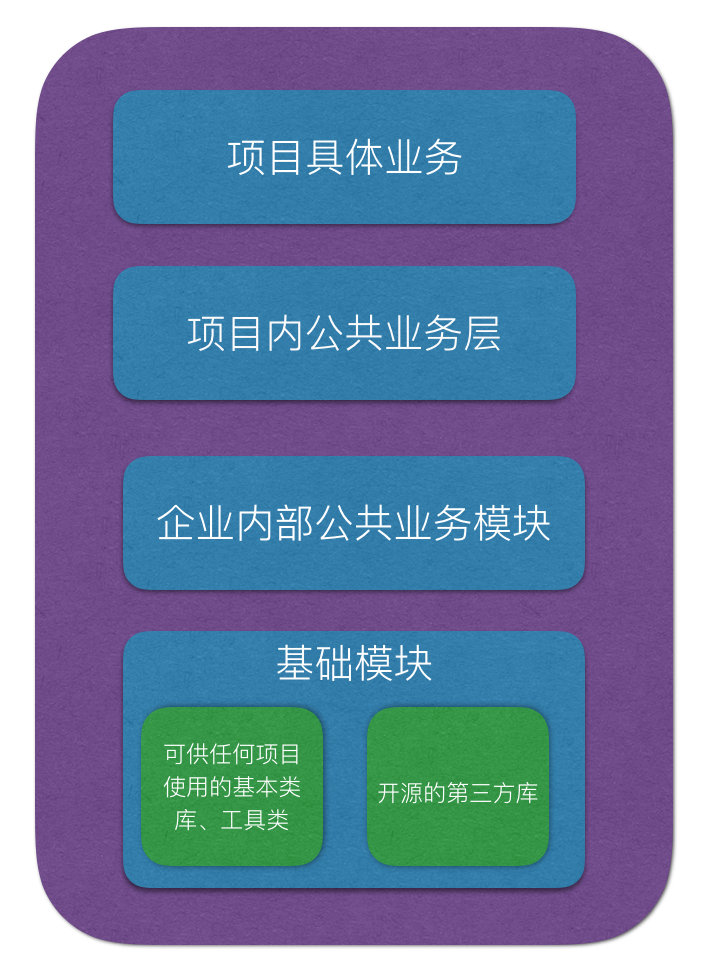

# 组件化、模块化和路由设计

### 一、 如何实现多个不同项目的代码复用？
 - 工具：私有 Pods + 多个不同的 Git repo
 - 模块划分

其实，上面说的这个解决方案，，也就是 16 年业界广泛讨论的组件化，目前已经比较成熟了。

### 二、 什么是组件化
「组件化」顾名思义就是把一个大的 App 拆成一个个小的组件，相互之间不直接引用。

组件化的优缺点：

- 优点：
  - 当项目变大起来后，逻辑会变得更复杂，代码耦合也会越来严重，通过组件化可以减低耦合度，使得模块之间的逻辑相互独立，减少依赖
  - 如果有多个项目的话，组件还可以跨应用复用
- 缺点：
  - 维护成本
  - 新成员的学习成本

### 三、 如何实现组件化
#### 1. 设计原则

- 越底层的模块，应该越稳定，越抽象，越具有高复用度。
- 不要让稳定的模块依赖不稳定的模块， 减少依赖
- 提升模块的复用度，自完备性有时候要优于代码复用（目的就是为了减少依赖）
- 按照架构的层数从上到下依赖，不要出现下层模块依赖上层模块的现象，业务模块之间也尽量不要耦合

#### 2. 架构、组件拆分
- 粗点的话比较有利于拆分，细点的话灵活度比较高
- 早期的话，建议拆分的粗点

#### 3. 组件间通信
通过 URL 路由的方式来进行页面间跳转，每个页面对应一个 URL

当组件A需要调用组件B时，向ModuleManager传递URL，参数跟随URL以GET方式传递，类似openURL。然后由ModuleManager负责调度组件B，最后完成任务。

回调？
- 单个页面的回调
- 包含多个页面的流程回调，比如，登录流程结束后，刷新页面

#### 4. 组件的生命周期
App启动时实例化各组件模块，然后这些组件向ModuleManager注册Url，有些时候不需要实例化，使用class注册。

#### 5. 版本管理

### 四、持续集成

### 五、周边设施

#### 1. 文档、demo、单元测试

#### 2. 公共 UI 组件的统一
在设计时需要跟 PM 和 UED 设计师沟通好，尽量保持风格一致，这样才能更好地发挥出 UI 组件的重用性。

### 参考：

- [iOS两个客户端代码复用小技巧](http://qingmo.me/2017/04/08/sharecode/)
- [模块化与解耦](https://blog.cnbluebox.com/blog/2015/11/28/module-and-decoupling/)
- [蘑菇街 App 的组件化之路](http://limboy.me/tech/2016/03/10/mgj-components.html)
- [Modular iOS: Strangling the Monolith](https://edit.theappbusiness.com/modular-ios-strangling-the-monolith-4a6843a28992)
- [Modular iOS: Splitting A Workspace into Modules](https://edit.theappbusiness.com/modular-ios-splitting-a-workspace-into-modules-331293f1090)
